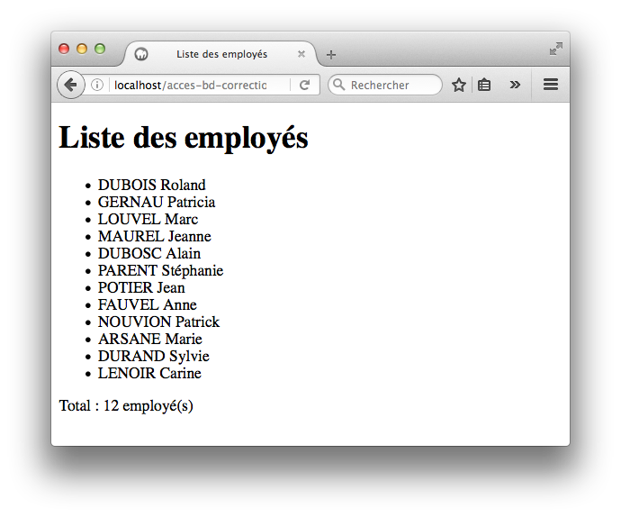
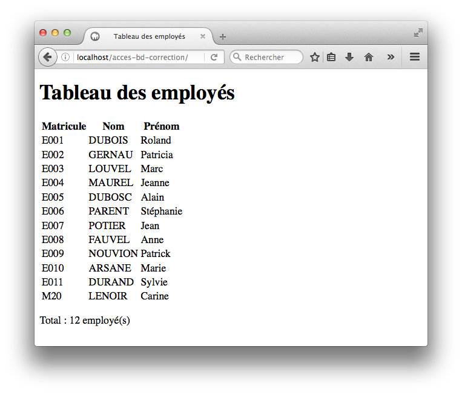
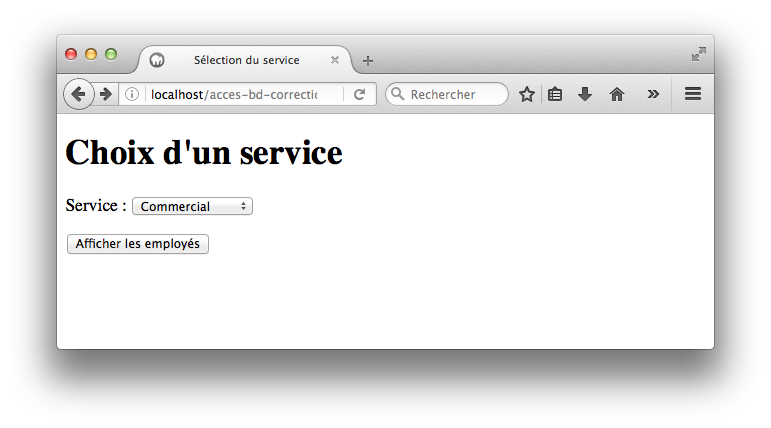
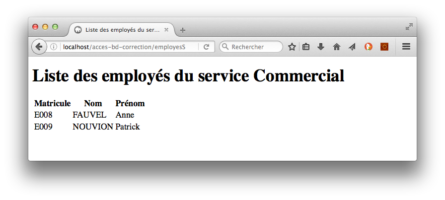

Codez ces exercices dans un sous-répertoire `acces-bd` de votre répertoire Web.

## Contexte

Cette activité exploite une base de données **Personnel** dont voici le script de création.

~~~sql
create database if not exists personnel character set utf8 collate utf8_unicode_ci;
use personnel;

grant all privileges on personnel.* to 'personnel_util'@'localhost' identified by 'secret';

drop table if exists employe;
drop table if exists service;

--
-- Structure de la table `service`
--

CREATE TABLE service (
  CodeServ char(3) NOT NULL default '',
  DesiServ varchar(30) NOT NULL default '',
  PRIMARY KEY  (CodeServ)
) ENGINE=InnoDB CHARACTER SET utf8 COLLATE utf8_general_ci;

--
-- Contenu de la table `service`
--

INSERT INTO service VALUES ('s01', 'Fabrication');
INSERT INTO service VALUES ('s02', 'Emballage');
INSERT INTO service VALUES ('s03', 'Commercial');
INSERT INTO service VALUES ('s04', 'Administration');

--
-- Structure de la table `employe`
--

CREATE TABLE employe (
  Matricule varchar(4) NOT NULL default '',
  NomEmpl varchar(25) NOT NULL default '',
  PrenomEmpl varchar(20) NOT NULL default '',
  CodeCadre char(1) NOT NULL default '',
  ServEmpl char(3) NOT NULL default '',
  PRIMARY KEY  (Matricule),
  constraint fk_empl_serv foreign key(ServEmpl) references service(CodeServ)
) ENGINE=InnoDB CHARACTER SET utf8 COLLATE utf8_general_ci;

--
-- Contenu de la table `employe`
--

INSERT INTO employe VALUES ('E001', 'DUBOIS', 'Roland', 'o', 's01');
INSERT INTO employe VALUES ('E002', 'GERNAU', 'Patricia', 'o', 's01');
INSERT INTO employe VALUES ('E003', 'LOUVEL', 'Marc', 'n', 's01');
INSERT INTO employe VALUES ('E004', 'MAUREL', 'Jeanne', 'n', 's01');
INSERT INTO employe VALUES ('E005', 'DUBOSC', 'Alain', 'n', 's02');
INSERT INTO employe VALUES ('E006', 'PARENT', 'Stéphanie', 'n', 's02');
INSERT INTO employe VALUES ('E007', 'POTIER', 'Jean', 'o', 's02');
INSERT INTO employe VALUES ('E008', 'FAUVEL', 'Anne', 'o', 's03');
INSERT INTO employe VALUES ('E009', 'NOUVION', 'Patrick', 'n', 's03');
INSERT INTO employe VALUES ('E010', 'ARSANE', 'Marie', 'n', 's04');
INSERT INTO employe VALUES ('E011', 'DURAND', 'Sylvie', 'o', 's04');
INSERT INTO employe VALUES ('M20', 'LENOIR', 'Carine', 'o', 's01');
~~~

## Exercice 1

Ecrivez une page PHP `listeEmployes.php` qui affiche la liste de tous les employés, ainsi que leur nombre total.

{:.centered}

## Exercice 2

Ecrivez une page PHP `tableauEmployes.php` qui affiche la liste de tous les employés dans un tableau.

{:.centered}

## Exercice 3

Ecrivez une page PHP `service.php` qui permet de sélectionner un service dans une liste déroulante. Les différents services sont extraits de la base de données.

{:.centered}

Ecrivez ensuite une page PHP `employesService.php` qui récupère le service sélectionné et affiche la liste des employés de ce service.

{:.centered}
