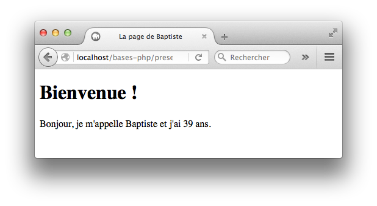

Codez ces exercices dans un sous-répertoire `bases-php` de votre répertoire Web.

## Exercice 1

Ecrivez une page PHP `presentation.php` qui affiche votre nom et votre âge. Ces informations doivent être stockées dans des variables. Le titre de la page doit être généré dynamiquement.

{:.centered}

## Exercice 2

Observez le code source PHP ci-dessous et tentez de prévoir les valeurs finales de chaque variable.

~~~
<?php
$a = 2;
$a = $a - 1;
$a++;

$b = 8;
$b += 2;

$c = $a + $b * $b;
$d = $a * $b + $b;
$e = $a * ($b + $b);
$f = $a * $b / $a;
$g = $b / $a * $a;
?>
~~~

Vérifiez vos résultats en intégrant ce code dans une page `mystere.php` puis en ajoutant des instructions pour afficher les valeurs des variables.

## Exercice 3

Ecrivez une page PHP `tva.php` qui déclare une variable `$prixHorsTaxes` dont vous choisirez librement la valeur. La page affiche ensuite le prix TTC correspondant (le taux de TVA sera fixé à 19,6% et stocké dans une variable).

{:.centered}

Testez votre programme en faisant varier le prix hors taxes.

## Exercice 4

Voici le code source d'une page `erreurs.php`.

~~~
<!doctype html>
<html>

<head>
    <meta charset="utf-8" />
    <title>Ma page de présentation</title>
</head>

<body>
    <h1>Ma présentation</h1>

    <?php
    $prenom = "Bill";
    $classe = 'BTS SIO'
    $nbLangages = 2;
    ?>
    
    

        <?php
        echo 'Bonjour, je m'appelle $prenom et je suis en $classe.'
        <!-- Un commentaire -->
         
        echo 'Je connais ' + $nbLangages + ' langages de programmation';
        ?>
    

</body>

</html>
~~~

* Corrigez-la pour qu'elle affiche le résultat suivant.

{:.centered}

* Déplacez la définition des variables dans un fichier `variables.php`.
