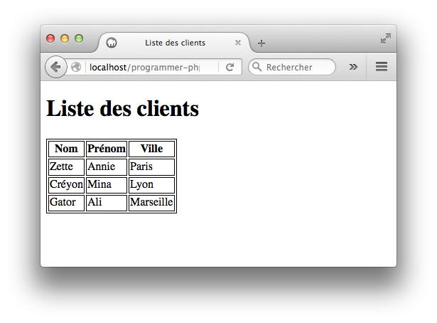

Vous réaliserez les exercices dans un dossier nommé `programmer-php`.

Le résultat obtenu dans le navigateur doit toujours être une page conforme au standard HTML5 (balises `<html>`, `<head>` et `<body>` présentes et correctement imbriquées).

## Exercice 1

Ecrivez une page PHP `multiplication.php` qui déclare une variable `$chiffre`, puis qui affiche la table de multiplication de ce chiffre.

Voici un exemple de résultat avec le chiffre 7.

{:.centered}

## Exercice 2
Ecrivez une page PHP `presentation.php` qui déclare 3 variables :

* `$prenom` qui contiendra votre prénom.
* `$classe` qui contiendra votre classe.
* `$langages` qui contiendra les langages que vous connaissez sous forme d'un tableau. Les valeurs du tableau seront les noms des langages.

La page PHP affiche le prénom, l'âge et les langages connus sous la forme ci-dessous. Le titre de la page est construit dynamiquement.

L'expérience est calculée de la manière suivante :

* Moins de 3 langages connus : "débutant"
* Entre 3 et 4 langages connus : "débrouillé"
* Plus de 4 langages connus : "aguerri"

{:.centered}

Créez ensuite une page `presentation-bis.php` dans laquelle le tableau `$langages` devient un tableau associatif. Les clés du tableau seront les noms des langages et les valeurs seront le niveau de maîtrise associé (de 1 pour débutant à 5 pour expert). 

Le niveau de maîtrise de chaque langage devra être affiché. 

{:.centered}

## Exercice 3

On vous fournit le tableau ci-dessous.

~~~php
$clients = array(
    array('Nom' => 'Zette', 'Prenom' => 'Annie', 'Ville' => 'Paris'),
    array('Nom' => 'Créyon', 'Prenom' => 'Mina', 'Ville' => 'Lyon'),
    array('Nom' => 'Gator', 'Prenom' => 'Ali', 'Ville' => 'Marseille')
);
~~~

Utilisez-le dans une page PHP `clients.php` pour afficher le résultat ci-dessous.

{:.centered}

## Solutions des exercices

[Accès aux solutions](https://github.com/lmdsio-si6/programmer-php-correction) (authentification nécessaire).
