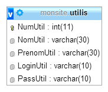
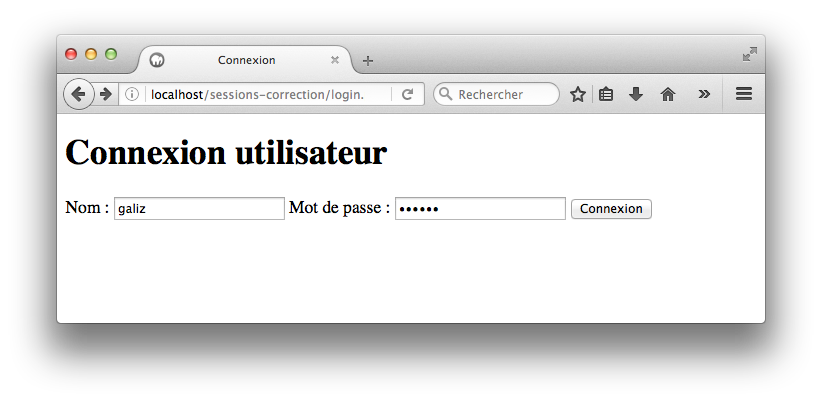
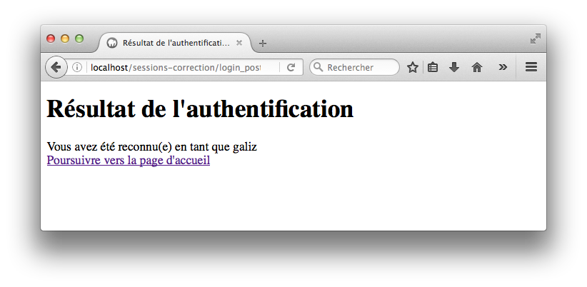
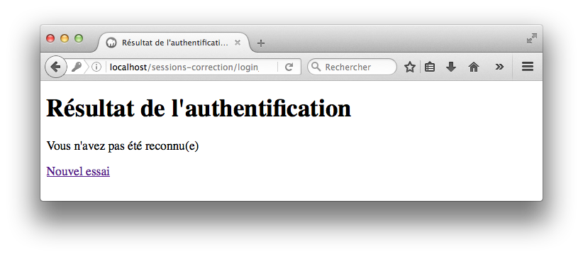
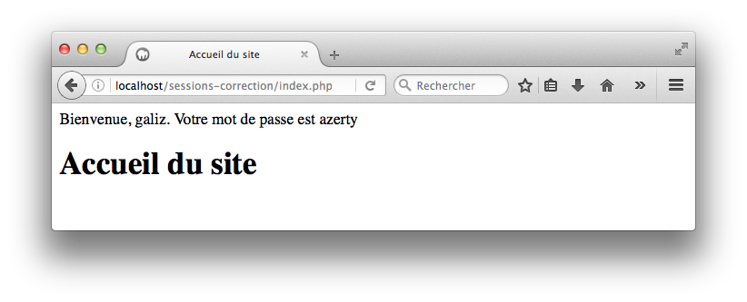
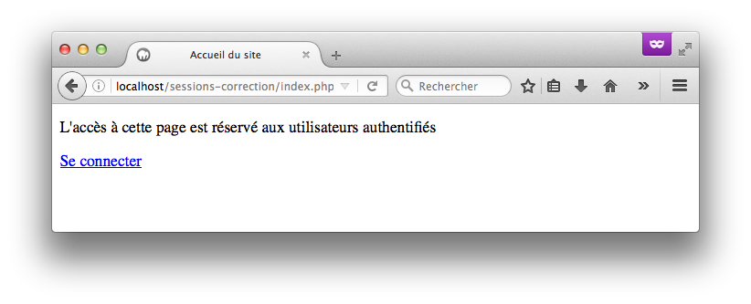

L'objectif de cette activité est de mettre en place un mécanisme d'authentification rudimentaire avec PHP.

Codez-la dans un sous-répertoire `sessions` de votre répertoire Web.

## Contexte

On dispose d'une base de données `monsite` contenant une seule table `utilis` dont voici la structure.

{:.centered}

Le script SQL associé est le suivant.

~~~SQL
create database if not exists monsite character set utf8 collate utf8_unicode_ci;
use monsite;

grant all privileges on monsite.* to 'monsite_util'@'localhost' identified by 'secret';

drop table if exists utilis;

CREATE TABLE utilis (
  NumUtil integer NOT NULL AUTO_INCREMENT,
  NomUtil varchar(30) NOT NULL,
  PrenomUtil varchar(30) NOT NULL,
  LoginUtil varchar(10) NOT NULL,
  PassUtil varchar(10) NOT NULL,
  PRIMARY KEY  (NumUtil)
) ENGINE=InnoDB CHARACTER SET utf8 COLLATE utf8_unicode_ci;

INSERT INTO utilis(NomUtil, PrenomUtil, LoginUtil, PassUtil) VALUES
('Alizan', 'Gaspar', 'galiz', 'azerty');
INSERT INTO utilis(NomUtil, PrenomUtil, LoginUtil, PassUtil) VALUES
('Diossy', 'Daisy', 'ddios', '12345');
~~~

La page `login.php` ci-dessous permet de créer un formulaire de connexion.

~~~php
<!doctype html>
<html>
    <head>
        <meta charset="UTF-8">
        <title>Connexion</title>
    </head>
    <body>
        <h1>Connexion utilisateur</h1>
        <form action="login_post.php" method="post">
            <label for="nom">Nom :</label>
            <input type="text" name="login" id="nom" required />
            <label for="mdp">Mot de passe :</label>
            <input type="password" name="mdp" id="mdp" required />
            <input type="submit" value="Connexion">
        </form>
    </body>
</html>
~~~

{:.centered}

La page `login_post.php` gère la publication du formulaire. Elle effectue une requête SQL afin de tenter de retrouver dans la base de données l'utilisateur identifié par le login et le mot de passe reçus du formulaire précédent, puis crée des variables de session si l'utilisateur est reconnu.

~~~php
<?php
session_start();  // démarrage d'une session

// on vérifie que les données du formulaire sont présentes
if (isset($_POST['login']) && isset($_POST['mdp'])) {
    require 'fonctions.php';
    $bdd = getBdd();
    // cette requête permet de récupérer l'utilisateur depuis la BD
    $requete = "SELECT * FROM utilis WHERE LoginUtil=? AND PassUtil=?";
    $resultat = $bdd->prepare($requete);
    $login = $_POST['login'];
    $mdp = $_POST['mdp'];
    $resultat->execute(array($login, $mdp));
    if ($resultat->rowCount() == 1) {
        // l'utilisateur existe dans la table
        // on ajoute ses infos en tant que variables de session
        $_SESSION['login'] = $login;
        $_SESSION['mdp'] = $mdp;
        // cette variable indique que l'authentification a réussi
        $authOK = true;
    }
}
?>

<!doctype html>
<html>
<head>
    <meta charset="UTF-8" />
    <title>Résultat de l'authentification</title>
</head>
<body>
    <h1>Résultat de l'authentification</h1>
    <?php
    if (isset($authOK)) {
        echo "
Vous avez été reconnu(e) en tant que " . escape($login) . "
";
        echo '<a href="index.php">Poursuivre vers la page d\'accueil</a>';
    }
    else { ?>
        
Vous n'avez pas été reconnu(e)

        
<a href="login.php">Nouvel essai

    <?php } ?>
</body>
</html>
~~~

{:.centered}

{:.centered}

La page `fonctions.php` contient les fonctions utilisées par les autres pages.

~~~php
<?php

/**
 * Nettoie une valeur insérée dans une page HTML
 * Doit être utilisée à chaque insertion de données dynamique dans une page HTML
 * Permet d'éviter les problèmes d'exécution de code indésirable (XSS)
 * @param string $valeur Valeur à nettoyer
 * @return string Valeur nettoyée
 */
function escape($valeur)
{
    // Convertit les caractères spéciaux en entités HTML
    return htmlspecialchars($valeur, ENT_QUOTES, 'UTF-8', false);
}

/**
 * Gère la connexion à la base de données
 * @return PDO Objet de connexion à la BD
 */
function getBdd() {
    return new PDO("mysql:host=localhost;dbname=monsite;charset=utf8",
        "monsite_util", "secret",
        array(PDO::ATTR_ERRMODE => PDO::ERRMODE_EXCEPTION));
}
~~~

Enfin, la page d'accueil `index.php` est personnalisée en fonction de la connexion ou non d'un utilisateur.

~~~php
<?php
session_start();  // démarrage d'une session

// on vérifie que les variables de session identifiant l'utilisateur existent
if (isset($_SESSION['login']) && isset($_SESSION['mdp'])) {
    $login = $_SESSION['login'];
    $mdp = $_SESSION['mdp'];
}
?>

<!doctype html>
<html>
    <head>
        <meta charset="UTF-8" />
        <title>Accueil du site</title>
    </head>
    <body>
        <?php
        if (isset($login) && isset($mdp)) {
            echo "Bienvenue, " . escape($login) . ". Votre mot de passe est " . escape($mdp) . ".";
            echo "<h1>Accueil du site</h1>";
        }
        else { ?>
           
L'accès à cette page est réservé aux utilisateurs authentifiés

           
<a href="login.php">Se connecter</a>

        <?php } ?>
    </body>
</html>
~~~

{:.centered}

{:.centered}

## Travail à réaliser

* Utilisez les ressources fournies pour créer puis tester localement le site. Vérifiez que vous obtenez le comportement attendu.
* Améliorez la page d'accueil afin qu'elle affiche le nom et le prénom de l'utilisateur connecté au lieu de son login et son mot de passe.
* Améliorez la page d'authentification afin qu'elle détaille l'erreur : login inconnu, login reconnu mais mot de passe incorrect.
