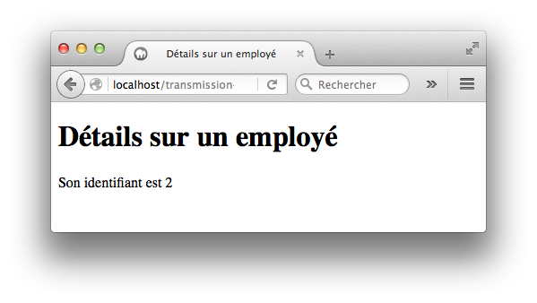
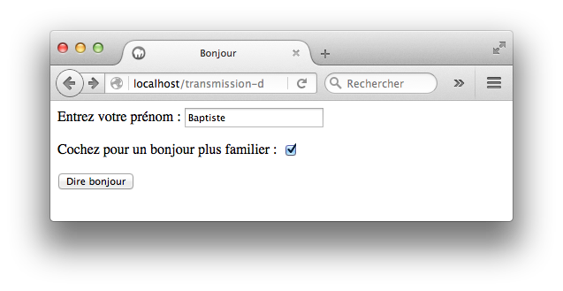
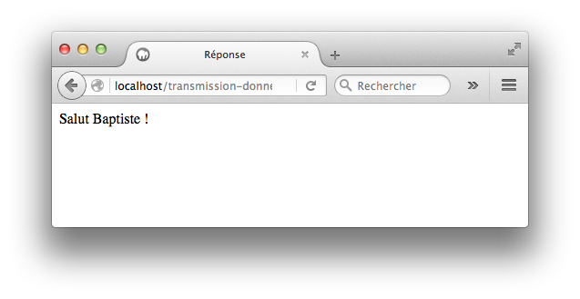

Vous réaliserez les exercices dans un dossier nommé `transmission-donnees`.

Le résultat obtenu dans le navigateur doit toujours être une page conforme au standard HTML5 (balises `<html>`, `<head>` et `<body>` présentes et correctement imbriquées).

## Exercice 1

Ecrivez une page `employes.php` affichant une liste de 3 employés avec un lien vers leurs détails. Ce lien doit pointer vers une URL de la forme `employe.php?id=<identifiant>`, le paramètre `<identifiant>` valant 1, 2 ou 3.

{:.centered}

Ecrivez ensuite une page `employe.php` qui affiche l'identifiant de l'employé reçu en paramètre dans l'URL.

{:.centered}

Le cas où aucun identifiant n'est fourni doit être géré.

{:.centered}

**Bonus** : écrivez la page `employes-bis.php` dans laquelle la liste des employés est générée par une boucle. Le nombre d'employés est passé en paramètre dans l'URL, exemple : `employes.php?nombre=8`.

{:.centered}

Le cas où aucun nombre n'est fourni doit être géré.

{:.centered}

## Exercice 2

Ecrivez une page `bonjour.php` permettant à l'utilisateur de saisir son prénom. Cette saisie est obligatoire.

{:.centered}

Le clic sur le bouton "Dire bonjour" envoie vers une page `reponse.php` affichant le message "Bonjour, " suivi du prénom saisi.

{:.centered}

Modifiez ensuite vos pages pour que l'utilisateur puisse choisir un bonjour plus familier ("Salut" au lieu de "Bonjour") sous la forme d'une case à cocher.

{:.centered}

{:.centered}

Enfin, ajoutez une formule de politesse grâce à des boutons radio.

{:.centered}

{:.centered}

**Bonus** : gérez la saisie et l'affichage dans la même page `bonjour-bis.php`.

## Exercice 3

Ecrivez une page `service.php` qui permet de sélectionner un service dans une liste déroulante. Les services possibles sont :

* "Administration" (code : s01)
* "Commercial" (code: s02)
* "Emballage" (code : s03)
* "Fabrication" (code : s04)

{:.centered}

Le clic sur le bouton "Sélectionner" envoie vers une page `service_post.php` qui affiche le code du service choisi.

{:.centered}

## Exercice 4

Réalisez le formulaire ci-dessous dans la page `machineCafe.php`, avec récupération des valeurs et affichage dans la même page. Les boissons possibles sont : "Café", "Thé", "Chocolat" et "Café crème".

{:.centered}

{:.centered}

## Exercice 5

Reprenez les exercices précédents pour les sécuriser contre l'injection de code JavaScript.
